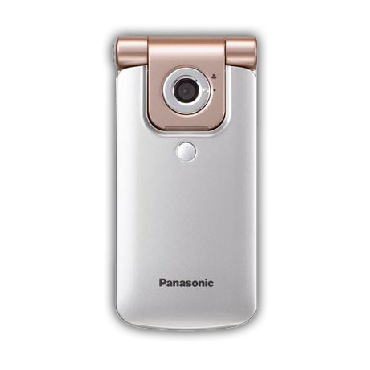
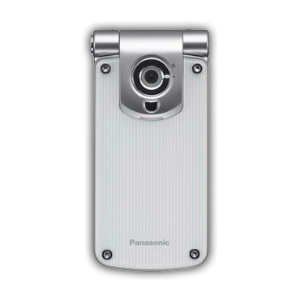
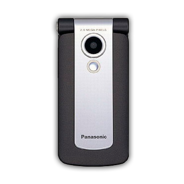
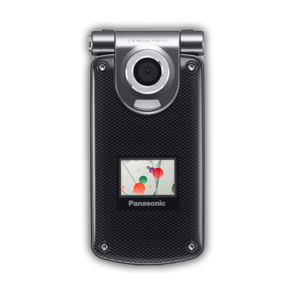
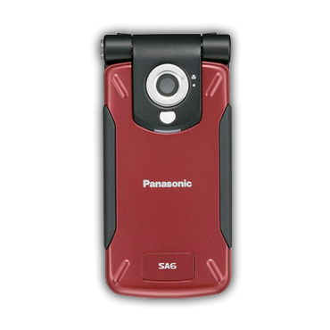
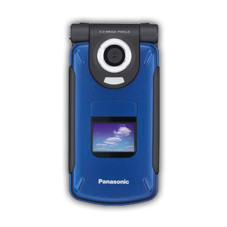
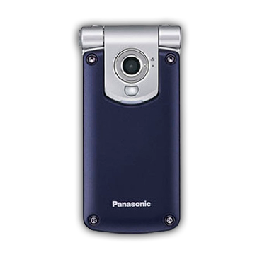
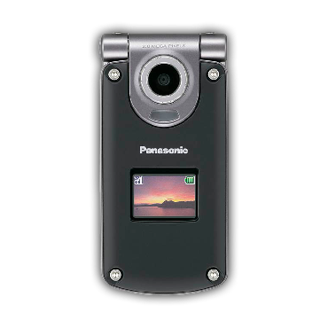
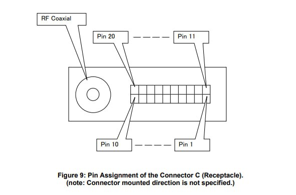
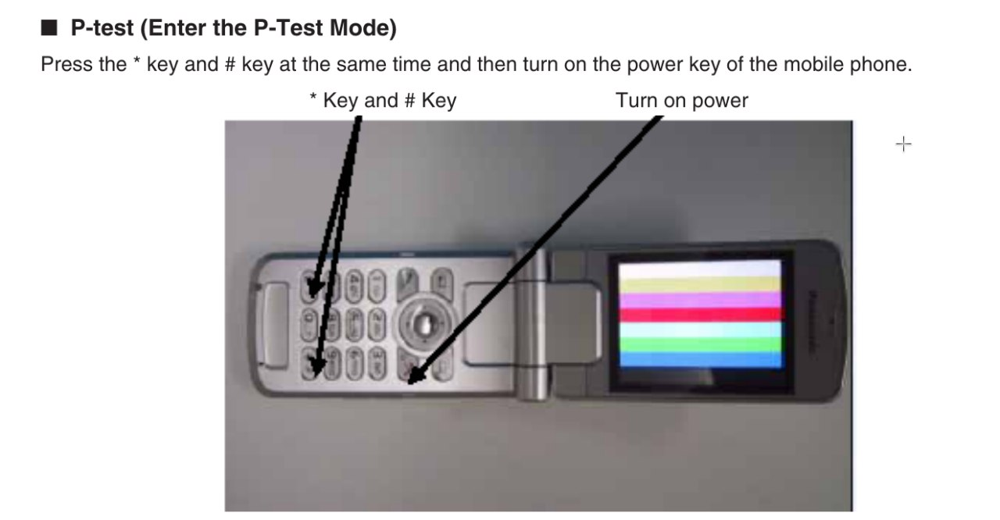

# Panasonic SGOLD

В некоторых телефонах Panasonic установлено железо от Infineon.
Галочкой отмечены те модели, фото внутренностей которых имеется. Остальное заполнено либо по FCCID, либо по наитию.

| Model               | VS2                    | VS3                    | VS6                    | VS7 ☑                       | SA6                    | SA7 ☑                       | MX6                    | MX7                         |
|:--------------------|:-----------------------|:-----------------------|:-----------------------|:----------------------------|:-----------------------|:----------------------------|:-----------------------|:----------------------------|
| Photo               |     |     |     |          |     |          |     |          |
| FCCID               |                        | NWJ23C002A             |                        | NWJ26C001A                  |                        |                             |                        |                             |
| OS                  | APOXI                  | APOXI                  | APOXI                  | APOXI                       | APOXI                  | APOXI                       | APOXI                  | APOXI                       |
| CPU                 | PMB8875                | PMB8875                | PMB8875                | PMB8875                     | PMB8875                | PMB8875                     | PMB8875                | PMB8875                     |
| POWER               | ?                      | PMB6812                | ?                      | PMB6811                     | ?                      | PMB6811                     | ?                      | PMB6811                     |
| RF                  | PMB6270                | PMB6270                | PMB6270                | PMB6270                     | PMB6270                | PMB6270                     | PMB6270                | PMB6270                     |
| PAM                 | SKY77328               | SKY77328               | SKY77328               | SKY77328                    | SKY77328               | SKY77328                    | SKY77328               | SKY77328                    |
| FLASH+RAM           | 64/16: PF38F4460LVYTB0 | 64/16: PF38F4460LVYTB0 | 64/16: PF38F4460LVYTB0 | 64/16: PF38F4460LVYTB0      | 64/16: PF38F4460LVYTB0 | 64/16: PF38F4460LVYTB0      | 64/16: PF38F4460LVYTB0 | 64/16: PF38F4460LVYTB0      |
| Resolution&bit&size | 240x320x24, 2.2"       | 240x320x24, 2.2"       | 240x320x24, 2.2"       | 240x320x24, 2.5" & 96x64x12 | 240x320x24, 2.2"       | 240x320x24, 2.5" & 96x64x12 | 240x320x24, 2.2"       | 240x320x24, 2.5" & 96x64x12 |
| LCD                 | ?                      | ?                      | ?                      | ?                           | ?                      | ?                           | ?                      | ?                           |
| GPU                 | S1D13756               | S1D13756               | S1D13756               | S1D13756                    | S1D13756               | S1D13756                    | S1D13756               | S1D13756                    |
| BT                  | no                     | no                     | PMB8761                | PMB8761                     | no                     | PMB8761                     | no                     | PMB8761                     |
| IrDA                | yes                    | yes                    | yes                    | yes                         | yes                    | yes                         | yes                    | yes                         |
| Camera              | 1.3 MP                 | 1.3 MP                 | 2.0 MP                 | 2.0 MP                      | 1.3 MP                 | 2.0 MP                      | 1.3 MP                 | 2.0 MP                      |
| Macro switch        | Outer                  | Outer                  | Inner                  | Inner                       | Outer                  | Inner                       | Outer                  | Inner                       |
| Bat.cap.            | 830 mAh                | 830 mAh                | 830 mAh                | 830 mAh                     | 1660 mAh               | 1660 mAh                    | 1660 mAh               | 1660 mAh                    |
| Covers              | Static                 | Changeable             | Static                 | Changeable                  | Static                 | Static                      | Changeable             | Changeable                  |
| Dimensions          | 96x46x18.2mm, 98g      | 96x46x17.6mm, 102g     | 96x46x21mm, 101g       | 102x51x18.8mm, 113g         | 96x47x25mm, 127g       | 102x53x26mm, 140g           | 96x46x26mm, 130g       | 102x51x26mm, 144g           |

# Проверка версии ПО
1. Включить телефон без SIM-карты.
2. Быстро ввести `*#9999#`.
3. Если ничего не произошло, то ввод был осуществлён недостаточно быстро.

# Подключение к ПК
Возможно двумя методами:
1. USB-кабель. Позволяет передавать файлы, использовать PTEST режим и делать дамп содержимого флеш-памяти или RAM. И даже немножечко патчить.
2. UART-кабель. Используется для работы с помощью Chaos boot из V_Klay и x65flasher.
3. В теории Bluetooth (при наличии) и IrDA, но это не было нами протестировано.

## Разъём телефона
Разъём на данных телефонах это [ARIB C](https://www.arib.or.jp/english/html/overview/doc/STD-T63V13_30/3_T12/ARIB-TR-T12/R99/27/A27A01-330.pdf).



## Распиновка UART
| Gnd | Rx | Tx |
|-----|----|----|
| 1   | 7  | 9  |

## Распиновка USB
| Gnd | D+ (USB_DP) | D- (USB_DN) | +5V (usb_vbus+ext_per) |
|-----|-------------|-------------|------------------------|
| 1   | 2           | 3           | 4+5                    |

## Установка драйверов
Драйверы вполне подходят из диска от производителя. Скачать тут - [VS7SA7_Handset_Manager_USB.zip](https://fw.fasoley.net/?file=panasonic/VS7SA7_Handset_Manager_USB.zip)
Проверены на Windows XP и Windows 8.1 x86.

# Как войти в PTEST
PTEST - production test - тестовый режим телефона. Предпочтителен для работы с телефоном в не предусмотренном производителем состоянии.
Нажать одновременно * и #, и, пока они нажаты, включить телефон красной кнопкой.



# Сервисное ПО
Применимо от самого Infineon с названием PhoneTool. Версии 50 и 60 дополняют друг друга: в 60 работает вкладка Audio и чтение/запись RAM, в 50 всё остальное.

## Скачать
- [PhoneTool x50](https://fw.fasoley.net/?file=panasonic/phonetool/PhoneTool%2050_setup.exe) + [патченная dwdio.dll](https://fw.fasoley.net/?file=panasonic/phonetool/dwdio.dll)
- [PhoneTool x60]

## Установка
- x50: установить, заменить в месте установки `dwdio.dll` на патченный, пользоваться.
- x60: распаковать, импортировать в реестр `x60factory-registri.zip\m\m\x60.reg`, пользоваться.

## Использование
После запуска в Settings указать нужный COM-порт.
Подключение по кнопке `Update info`, если не получается с первого раза - понажимать кнопки `V24 AT# on/off`.

# Дамп содержимого флеш-микросхемы
Можно сделать как из Linux, так и из Windows любым кабелем (USB или UART).
Сначала надо ввести телефон в PTEST.

## Arch Linux
```bash
yay -S pnpm
git clone https://github.com/siemens-mobile-hacks/node-sie-serial
cd node-sie-serial/
pnpm i
npx tsx examples/dwd-apoxi-memory-dump.js \
  --addr 0xA0000000 \     # Адрес в памяти, с которого начинается флеш-память устройства
  --size 0x4000000 \      # Длина считывания, 64 мегабайта
  --out ./sa7-vq24.bin \  # Имя файла, куда будет сохранено содержимое
  --port /dev/ttyACM0     # Путь к устройству
```

## Windows
1. https://scoop.sh/
2. https://git-scm.com/downloads/win
3. `scoop bucket add main`
4. `scoop install main/nodejs`
5. `corepack enable`
6. `git clone https://github.com/siemens-mobile-hacks/node-sie-serial`
7. `cd node-sie-serial`
8. `pnpm i`
9. `npx tsx examples/dwd-apoxi-memory-dump.js --addr 0xA0000000 --size 0x4000000 --out .\sa7-vq24.bin --port COM7`

# Разблокировка загрузчика
Аналогично возможна и на Linux, и на Windows любым кабелем (USB или UART).
Выполняется из PTEST.
Требуется для возможности записи флеш-памяти в телефон при помощи V_Klay или x65flasher.

## Linux
1. `cd node-sie-serial`
2. `npx tsx examples/dwd-apoxi-unlock-boot.ts --port /dev/ttyACM0`

## Windows
1. `cd node-sie-serial`
2. `npx tsx examples\dwd-apoxi-unlock-boot.ts --port COM7`

# Запись флеш-памяти
Возможна только по UART.
Кратко: устанавливаем [V_Klay](https://fw.fasoley.net/?file=panasonic/v_klay_setup.zip), подкладываем ему [pmb8875_test_point.vkd](https://fw.fasoley.net/?file=panasonic/pmb8875_test_point.vkd) в папку `Program Files\Vi-Soft\V_Klay\loaders\` и после этого выбрав этот загрузчик соединяемся с телефоном на скорости 115200 для записи или 921600 для чтения.
С [x65flasher](https://fw.fasoley.net/?file=panasonic/x65Flasher-2103.rar) несколько проще: выбираем загрузчик "Телефон с введённым SKEY", работаем на тех же скоростях.

# Прошивка более свежей версии ПО
Возможна только по UART.
Сначала нужно сделать резервную копию своего EEPROM так как в нём содержатся калибровки радиотракта и батареи. Это можно сделать с помощью PhoneTool x50, указав файл конфигурации EEPROM (для VS7/SA7/MX7 это [leopard_eep150.cfg](https://fw.fasoley.net/?file=panasonic/eeprom/leopard_eep150.cfg)).
Сохранив резервную копию EEPROM, скачиваем дамп нужной версии, записываем его в телефон с помощью x65flasher или V_Klay.
Затем снова подключаем телефон к PhoneTool x50 и импортируем в него сохранённый ранее дамп EEPROM.
