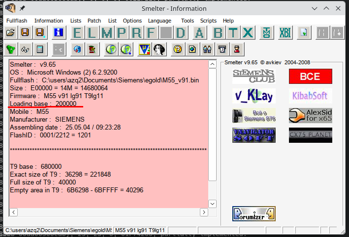
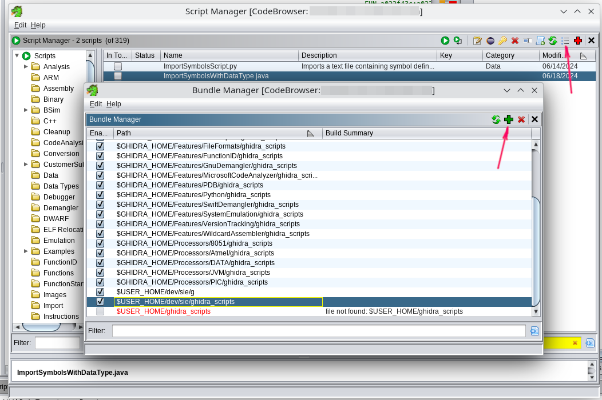
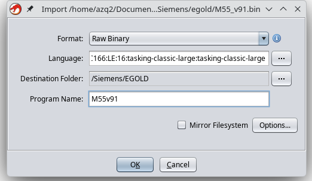
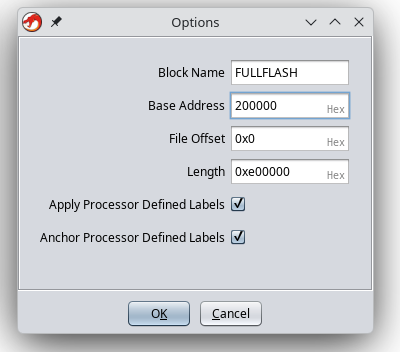

# Реверсим в Ghidra SRE

Ghidra SRE используется в качестве основной платформы реверс-инжиниринга. Все представленные на сайте инструкции и инструменты рассчитаны на работу с Ghidra.

Эта инструкция поможет всего за несколько шагов погрузиться в мир реверс-инжиниринга.

:::warning
Официальная версия Ghidra не умеет корректно работать с far-pointers. Вы **должны** использовать [исправленную версию Ghidra](https://github.com/siemens-mobile-hacks/ghidra-patched) при работе с прошивками E-GOLD.
:::

### Что сделать перед началом

1. Установите [исправленную версию Ghidra](https://github.com/siemens-mobile-hacks/ghidra-patched).

2. Установите [поддержку C166 в Ghidra](https://github.com/siemens-mobile-hacks/c166-ghidra-module).
  Сделать это можно в `File -> Install Extensions`

3. Получите fullflash с телефона.

4. Снимите дампы RAM и SRAM с вашего телефона.

### Шаг 1: Узнайте базу загрузки вашего fullfhash

Сделать это можно используя [Smelter](https://web.archive.org/web/20090414122112/http://avkiev.kiev.ua/Siemens/Smelter/Smelter.htm).

   <details>
      
   </details>

### Шаг 2: Установите наши плагины для Ghidra

<details>  </details>

1. Скачайте: [ghidra\_scripts.zip](https://github.com/siemens-mobile-hacks/ghidra_scripts/archive/refs/heads/main.zip) или клонируйте [репозиторий](https://github.com/siemens-mobile-hacks/ghidra_scripts)
2. Откройте `Window -> Script Manager`
3. Нажмите на "Manage Script Directories"
4. Добавьте путь к распакованной папке `ghidra_scripts`.

### Шаг 3: Загрузите ваш fullflash.bin в Ghidra

   <details>
      

      
   </details>

1. Запустите дизассемблер и выберите `File -> Import File`

2. Выберите файл `fullflash.bin`

3. Настройте параметры импорта:

   * Format: `Raw Binary`
   * Language: `Infineon C167CR	TASKING Classic large`
   * Options → Block Name: `FULLFLASH`
   * Options → Base Address: `200000` (сюда тот адрес, что указан в Smelter)

4. Щёлкните по `fullflash.bin` в списке проекта.

5. Ghidra предложит автоматический анализ, нужно отказаться (**нажмите No**).

### Шаг 4: Правка атрибутов региона FULLFLASH

Перейдите в `Window -> Memory Map` и выставьте атрибуты для блока "FULLFLASH":

```
 R   W   X    Volatile
[x] [ ] [x]     [ ]
```

Очень важно снять галочку `W`, так как это напрямую влияет на декомпиляцию.

### Шаг 5: Удаляем лишние memory regions

1. Перейдите в `Window -> Memory Map`
2. Удаляем XRAM, CAN, IRAM

Остальные не трогаем.

### Шаг 6: Настройка параметров авто-анализа

1. Выберите `Analysis -> Auto Analyse`

2. Измените параметры анализа:

   Отключить:

   * [ ] `Embedded media`
   * [ ] `Non-returning functions - discovered` (иначе дизассемблер может преждевременно останавливаться внутри функции)
   * [ ] `Demangler GNU`

   Включить:

   * [x] `Scalar operand references`
   * [x] `Shared return calls` с опцией `[x] Allow conditional jumps`

3. Нажмите **"APPLY"**, но **НЕ НАЖИМАЙТЕ "ANALYZE"!!!**

4. Закройте окно анализа.

### Шаг 7: Импортируем ранее сохранённую RAM

Пример для M55:

1. `File -> Add to Program`
2. Выберите файл, например: `M55v91_RAM.bin`
3. Укажите параметры:

   * Block Name: `RAM`
   * Base Addr: `0x000000`
   * [x] Overlay

   Нажмите "OK".
4. Перейдите в `Window -> Memory Map` и задайте атрибуты для блока "RAM":

   ```
    R   W   X    Volatile
   [x] [x] [x]     [ ]
   ```

### Шаг 8: Найди любой код

Обычно достаточно перейти к 0x0 или 0x800000 (в зависимости от прошивке), затем нажать `D` (декомпиляция).

### Шаг 9: Авто-анализ прошивки

**Полный анализ**

1. Откройте `Analysis -> Auto Analyse 'fullflash.bin'`
2. Убедитесь, что параметры совпадают с указанными в **Шаг 3**
3. Нажмите **ANALYSE**

Это займёт 10-30 минут. Процесс долгий — наберитесь терпения.

### Поздравляю, вы справились! ✨

Ждём ваших патчей в базе патчей <a href="https://patches.kibab.com">patches.kibab.com</a> :)
