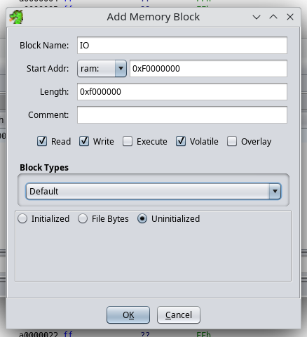
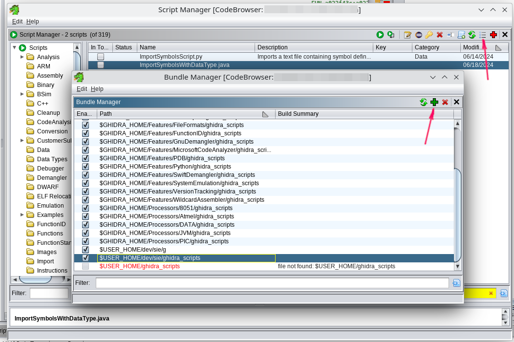
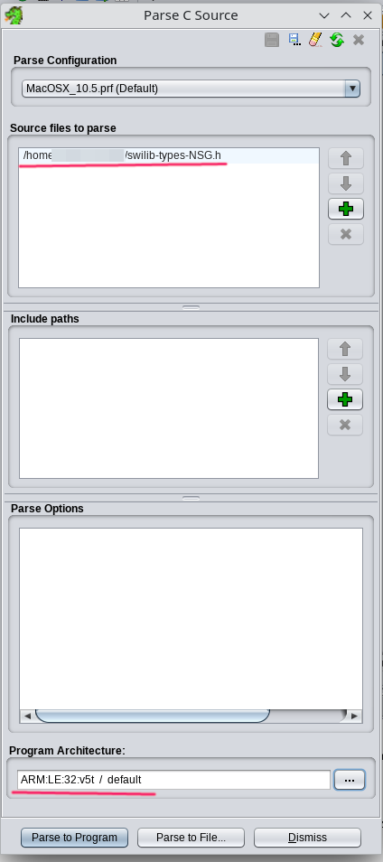
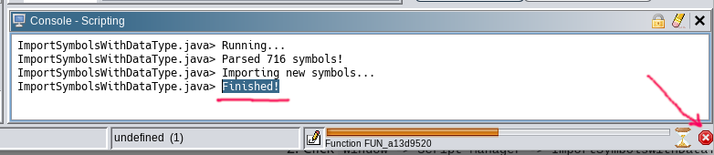

# Реверсим в Ghidra SRE

Ghidra SRE используется в качестве основной платформы реверс-инжиниринга. Все представленные на сайте инструкции и инструменты рассчитаны на работу с Ghidra.

Эта инструкция поможет всего за несколько шагов погрузиться в мир реверс-инжиниринга.

:::warning
Примерно с 2019 года в Ghidra SRE присутствует баг: `FF FF` в архитектуре v5t распознаётся как инструкция `BL 0xFFE`. Это вызывает бесконечный цикл в автоанализе.

Вы **должны** применить [патч ARMTHUMBinstructions.sinc](./fixing-ghidra), если планируете работать с прошивками Siemens.
:::

### Что сделать перед началом

1. Установите последнюю версию **Ghidra SRE** и примените патч [ARMTHUMBinstructions.sinc](./fixing-ghidra)

2. Получите fullflash с телефона и удалите из него FFS и EEPROM.

   Это важно для автоанализа, так как FFS и EEPROM содержат неоднозначные данные, которые могут быть интерпретированы как инструкции.

   Вы можете скачать коллекцию прошивок с уже удалёнными FFS и EEPROM: [fullflashes.zip](https://github.com/siemens-mobile-hacks/elfloader3/releases/download/v0/fullflashes.zip)

3. [Снимите дампы RAM и SRAM с вашего телефона](./memory-dump.md).

### Шаг 1: Загрузите ваш fullflash.bin в Ghidra

   <details>
      

      
   </details>

1. Запустите дизассемблер и выберите `File -> Import File`

2. Выберите файл `fullflash.bin`

3. Настройте параметры импорта:

   * Format: `Raw Binary`
   * Language: `ARM v5t 32 little`
   * Options → Block Name: `FULLFLASH`
   * Options → Base Address: `A0000000`

4. Щёлкните по `fullflash.bin` в списке проекта.

5. Ghidra предложит автоматический анализ, нужно отказаться (**нажмите No**).

### Шаг 2: Правка атрибутов региона FULLFLASH

Перейдите в `Window -> Memory Map` и выставьте атрибуты для блока "FULLFLASH":

```
 R   W   X    Volatile
[x] [ ] [x]     [ ]
```

Очень важно снять галочку `W`, так как это напрямую влияет на декомпиляцию.

### Шаг 3: Настройка параметров авто-анализа

1. Выберите `Analysis -> Auto Analyse`

2. Измените параметры анализа:

   Отключить:

   * [ ] `Embedded media`
   * [ ] `Non-returning functions - discovered` (иначе дизассемблер может преждевременно останавливаться внутри функции)
   * [ ] `Create Address Tables` (лучше запустить как one-shot после основного анализа)
   * [ ] `Demangler GNU`

   Включить:

   * [x] `Scalar operand references`
   * [x] `Shared return calls` с опцией `[x] Allow conditional jumps`

3. Нажмите **"APPLY"**. но **НЕ НАЖИМАЙТЕ "ANALYZE"!!!**

4. Закройте окно анализа.

### Шаг 4: Регион памяти для IO регистров

   <details>  </details>

1. Перейдите в `Window -> Memory Map`
2. Добавьте новый регион с параметрами:

   * Block Name: `IO`
   * Start Addr: `0xF0000000`
   * Length: `0x0F000000`
   * Attributes: `[x] Read   [x] Write   [ ] Execute   [x] Volatile   [ ] Overlay`
   * Uninitialized

### Шаг 5: Импорт дампа RAM с телефона

Импортируйте все полученные ранее [дампы памяти](./memory-dump.md).

Пример с RAM:

1. `File -> Add to Program`
2. Выберите файл, например: `C81v51_RAM_A8000000_00800000.bin`
3. Укажите параметры:

   * Block Name: `RAM`
   * Base Addr: `0xA8000000`

   Нажмите "OK".
4. Перейдите в `Window -> Memory Map` и задайте атрибуты для блока "RAM":

   ```
    R   W   X    Volatile
   [x] [x] [x]     [ ]
   ```

### Шаг 6: Плагины для Ghidra

<details>  </details>

1. Скачайте: [ghidra\_scripts.zip](https://github.com/siemens-mobile-hacks/ghidra_scripts/archive/refs/heads/main.zip) или клонируйте [репозиторий](https://github.com/siemens-mobile-hacks/ghidra_scripts)
2. Откройте `Window -> Script Manager`
3. Нажмите на "Manage Script Directories"
4. Добавьте путь к распакованной папке `ghidra_scripts`.

### Шаг 7: Импорт C-типов из swilib

<details>  </details>

1. Скачайте подходящий `swilib-types-PLATFORM.h` из [Swilib data types for disassembler](https://siemens-mobile-hacks.github.io/web-dev-tools/re#swilib-types)
2. Выберите `File -> Parse C Source...`
3. Нажмите `Clear profile` (значок ластика)
4. Добавьте `swilib-types-PLATFORM.h` в `Source files to parse`
5. Установите `Program architecture`: `ARM v5t 32 little`
6. Нажмите `Parse to Program -> Continue -> Don't use Open Archives -> OK`

### Шаг 9: Импорт списка IO регистров CPU

1. Скачайте соответствующий `cpu-PHONE.txt` или `cpu-pmb887x.txt` из [CPU IO registers](https://siemens-mobile-hacks.github.io/web-dev-tools/re#cpu-registers)
2. Откройте `Window -> Script Manager -> ImportSymbolsWithDataType.java -> Run Script`
3. Выберите `cpu-PHONE.txt` или `cpu-pmb887x.txt`

### Шаг 10: Импорт символов swilib

<details>  </details>

1. Скачайте подходящий `symbols-PHONE.txt` из [Firmware symbols for disassembler](https://siemens-mobile-hacks.github.io/web-dev-tools/re#swilib-symbols)
2. Откройте `Window -> Script Manager -> ImportSymbolsWithDataType.java -> Run Script`
3. Выберите `symbols-PHONE.txt`

Это займёт некоторое время, так как запустится авто-анализ.

Когда увидите "Finished" в консоли скриптов — можете прервать анализ и переходить дальше.

### Шаг 11: Авто-анализ прошивки

**Полный анализ**

1. Откройте `Analysis -> Auto Analyse 'fullflash.bin'`
2. Убедитесь, что параметры совпадают с указанными в **Шаг 3**
3. Нажмите **ANALYSE**

Это займёт 10-30 минут. Процесс долгий — наберитесь терпения.

**Запустить только 1 раз**

1. Выберите `Analysis -> One-shot -> Create Address Tables`

### Поздравляю, вы справились! ✨

Ждём ваших патчей в базе патчей <a href="https://patches.kibab.com">patches.kibab.com</a> :)
