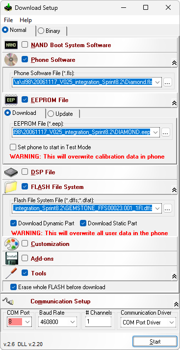

# IFWD FlashTool E2

**Автор:** Infineon Technologies Denmark A/S 
**Платформы:** APOXI

IFWD FlashTool E2 загружает прошивку, EEPROM, файловую систему, NAND boot system и DSP-файлы в телефоны на платформе APOXI.

Поддерживаются последовательное и USB-подключение, несколько каналов, проверка контрольных сумм, предварительное стирание flash-памяти и проверка записанных данных. В комплект входит консольная утилита `IFX_DL` для автоматизации прошивки.

## Версии

- **2.6** — [ifwd-flashtool-e2-2.6.zip](https://git.siepatch.dev/siepatch/soft/media/branch/main/catalog/service/ifwd-flashtool-e2/files/ifwd-flashtool-e2-2.6.zip) (2008-05-28) Windows 32-bit · 2.69 МиБ
