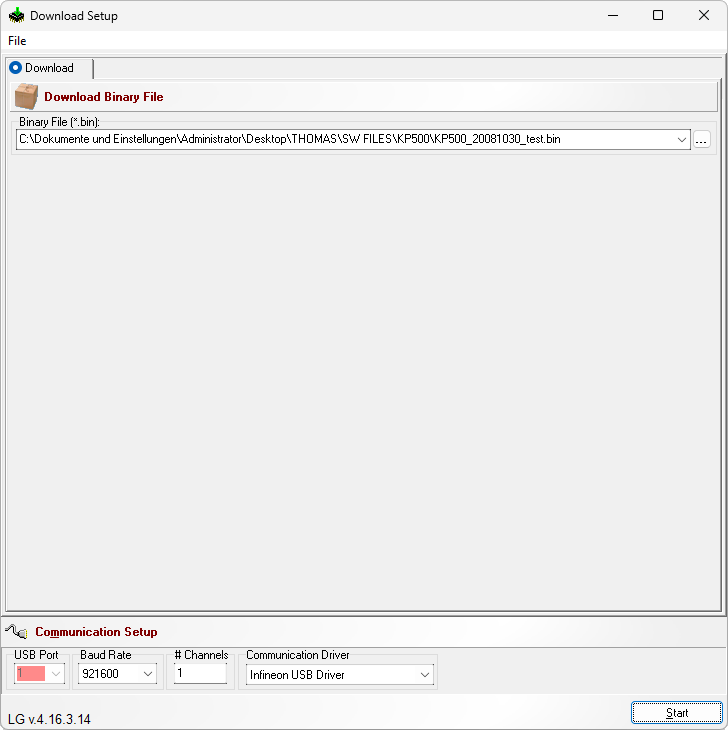

# KP500 Flashing Tool

**Автор:** Infineon Technologies Denmark A/S 
**Платформы:** APOXI

Вариант FlashTool E2 для LG KP500. Программа записывает файлы прошивки через последовательный или USB-интерфейс Infineon.

В комплект входят IFWD Download DLL, драйвер FlashUSB, драйвер кабеля Prolific PL-2303 и инструкция по установке USB-драйвера.

## Версии

- **0.0.3.14** — [kp500-flashing-tool-0.0.3.14.zip](https://git.siepatch.dev/siepatch/soft/media/branch/main/catalog/service/kp500-flashing-tool/files/kp500-flashing-tool-0.0.3.14.zip) Windows 32-bit · 2.59 МиБ
