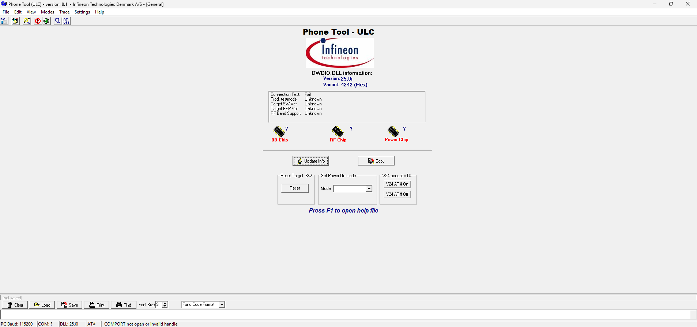

# Phone Tool

**Автор:** Infineon Technologies Denmark A/S 
**Платформы:** APOXI

Официальный сервисный фреймворк Infineon для телефонов на платформе APOXI. Содержит редакторы EEPROM и файловой системы, средства калибровки радиотракта, аудиопараметров, питания и зарядки, терминал и диагностические тесты.

## Версии

- **50.00** — [phone-tool-50.00.zip](https://git.siepatch.dev/siepatch/soft/media/branch/main/catalog/service/phone-tool/files/phone-tool-50.00.zip) (2008-05-28) Windows 32-bit · 5.84 МиБ
- **50.00** — [phone-tool-50.00-lg.zip](https://git.siepatch.dev/siepatch/soft/media/branch/main/catalog/service/phone-tool/files/phone-tool-50.00-lg.zip) (2008-05-28) Конфигурация для телефонов LG Windows 32-bit · 5.62 МиБ
- **8.1** — [phone-tool-8.1-ulc.zip](https://git.siepatch.dev/siepatch/soft/media/branch/main/catalog/service/phone-tool/files/phone-tool-8.1-ulc.zip) (2006-11-29) Версия ULC, также распространявшаяся для LG Shine Windows 32-bit · 8.94 МиБ
- **9.4.0.31** — [phone-tool-9.4.0.31-x60.zip](https://git.siepatch.dev/siepatch/soft/media/branch/main/catalog/service/phone-tool/files/phone-tool-9.4.0.31-x60.zip) (2004-05-25) Windows 32-bit · 4.77 МиБ
