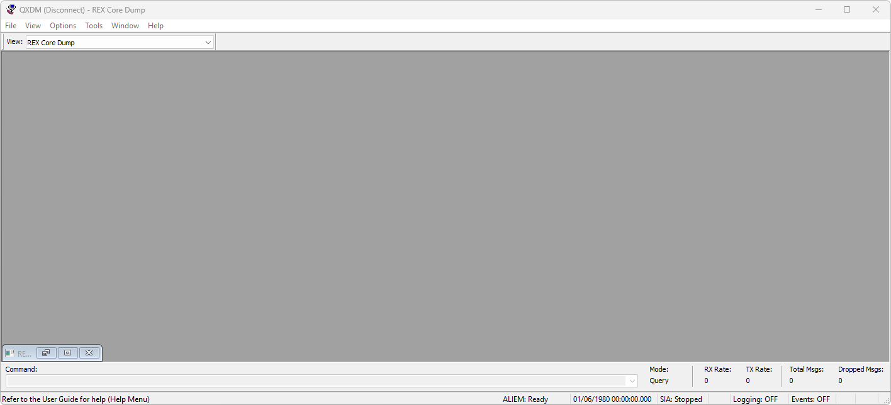

# QXDM

**Автор:** QUALCOMM Incorporated 
**Платформы:** BREW

Qualcomm eXtensible Diagnostic Monitor принимает диагностические сообщения и события телефона, записывает журналы ISF и позволяет
просматривать, фильтровать и разбирать собранные данные. Программа поддерживает диагностические команды, автоматизацию и подключаемые
расширения.

## Версии

- **3.09.19** — [qxdm-3.09.19.zip](https://git.siepatch.dev/siepatch/soft/media/branch/main/catalog/development/debugging/qxdm/files/qxdm-3.09.19.zip) Windows 32-bit · 15.9 МиБ

<strong>Архивные версии (2)</strong>

- **3.09.16** — [qxdm-3.09.16.zip](https://git.siepatch.dev/siepatch/soft/media/branch/main/catalog/development/debugging/qxdm/files/qxdm-3.09.16.zip) В комплекте модифицированный QXDM.exe без ограничения срока работы Windows 32-bit · 16.7 МиБ
- **3.09.10** — [qxdm-3.09.10.zip](https://git.siepatch.dev/siepatch/soft/media/branch/main/catalog/development/debugging/qxdm/files/qxdm-3.09.10.zip) Windows 32-bit · 13.9 МиБ

