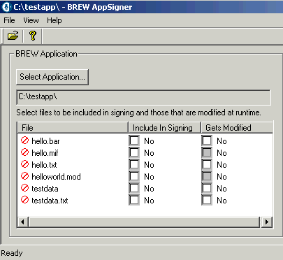

# BREW App Signer

**Платформы:** BREW

Утилита подписывает бинарные приложения BREW перед их установкой на телефон.

## Версии

- **1.0** — [brew-app-signer-1.0.zip](https://git.siepatch.dev/siepatch/soft/media/branch/main/catalog/development/utilities/brew-app-signer/files/brew-app-signer-1.0.zip) Windows 32-bit · 452 КиБ
