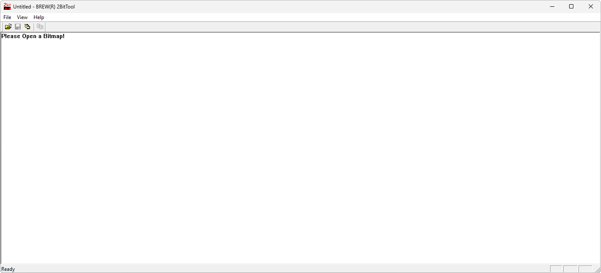

# BREW Utilities

**Автор:** QUALCOMM Incorporated 
**Платформы:** BREW

Набор содержит три утилиты:

- BREW 2BitTool для преобразования изображений в двухбитный формат BREW;
- NMEALogger для записи данных GPS в формате NMEA;
- PVConv для преобразования монофонических WAV 8 кГц, 16 бит в Qualcomm PureVoice QCP и обратно.

## Версии

- **1.61** — [brew-utilities-1.61.zip](https://git.siepatch.dev/siepatch/soft/media/branch/main/catalog/development/utilities/brew-utilities/files/brew-utilities-1.61.zip) Windows 32-bit · 167 КиБ
