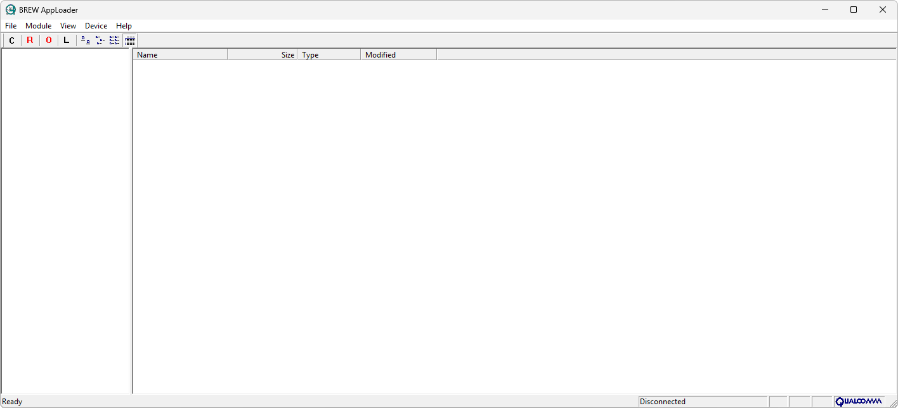

# BREW AppLoader

**Автор:** QUALCOMM Incorporated; патч — VeXed 
**Платформы:** BREW

BREW AppLoader предназначен для работы с файловой системой телефона через
последовательный порт. Программа позволяет:

- Просматривать файлы, каталоги и установленные BREW-модули;
- Копировать файлы между компьютером и телефоном;
- Создавать и удалять каталоги;
- Удалять файлы и модули;
- Просматривать занятое и свободное место в EFS;
- Работать через графический или консольный интерфейс.

BALpatch открывает в BREW AppLoader доступ к корневому каталогу EFS.

## Версии

- **1.0.2.5** — [brew-apploader-1.0.2.5.zip](https://git.siepatch.dev/siepatch/soft/media/branch/main/catalog/explorers/brew-apploader/files/brew-apploader-1.0.2.5.zip) (2001-10-26) В комплекте BALpatch 1.02.0009 для доступа к корневому каталогу EFS Windows 32-bit · 535 КиБ
