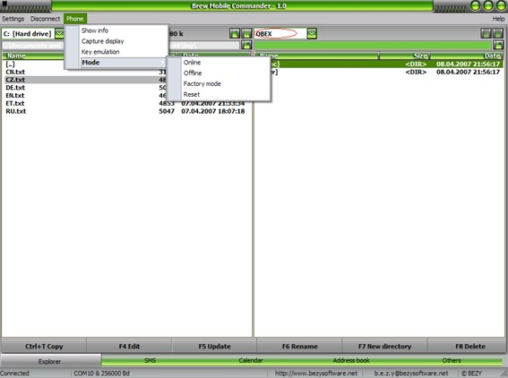

{/* Generated by tools/generateSoftware.ts. Do not edit manually. */}

# Brew Mobile Commander

**Домашняя страница:** [http://bmc.bezysoftware.net/](https://web.archive.org/web/20071229023804/http://bmc.bezysoftware.net/) (web archive) 
**Автор:** BEZY 
**Платформы:** BREW

Brew Mobile Commander (BMC) предназначен для управления телефонами Siemens и
BenQ-Siemens с поддержкой BREW. Полностью поддерживаются Siemens SXG75 и SG75,
BenQ-Siemens EF81 и SL91; частично — другие телефоны на чипсетах Qualcomm,
включая S81.

Возможности:

- Копирование файлов между компьютером и телефоном по OBEX или BREW и обычные операции двухпанельного файлового менеджера;
- Просмотр принятых SMS и отправка сообщений;
- Просмотр и редактирование адресной книги;
- Работа с календарём, группами и профилями GPRS;
- Установка Java-приложений, игр и тем;
- Редактирование разрешений Java-приложений;
- Снимки экрана телефона.

## Версии

- **1.3.2** — [brew-mobile-commander-1.3.2.zip](https://git.siepatch.dev/siepatch/soft/media/branch/main/catalog/explorers/brew-mobile-commander/files/brew-mobile-commander-1.3.2.zip) (2007-11-19) Windows 32-bit · 1.09 МиБ

<strong>Архивные версии (1)</strong>

- **1.1** — [brew-mobile-commander-1.1.zip](https://git.siepatch.dev/siepatch/soft/media/branch/main/catalog/explorers/brew-mobile-commander/files/brew-mobile-commander-1.1.zip) (2007-06-10) Windows 32-bit · 1.17 МиБ

