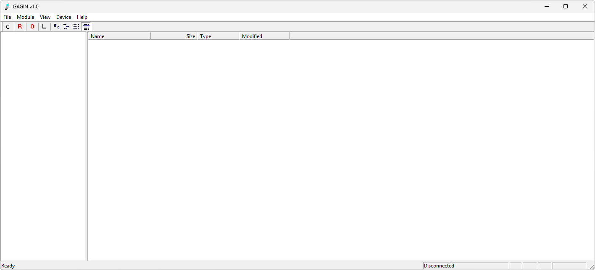

{/* Generated by tools/generateSoftware.ts. Do not edit manually. */}

# GAGIN

**Автор:** GAGIN 
**Платформы:** BREW

GAGIN показывает каталоги и файлы встроенной файловой системы BREW, копирует файлы между телефоном и компьютером, удаляет их и
показывает размер каталогов. Программа также загружает и удаляет модули BREW с комплектом файлов MIF, MOD, SIG и BAR и умеет переводить
телефон в автономный режим.

## Версии

- **1.0** — [gagin-1.0.zip](https://git.siepatch.dev/siepatch/soft/media/branch/main/catalog/explorers/gagin/files/gagin-1.0.zip) Windows 32-bit · 407 КиБ
