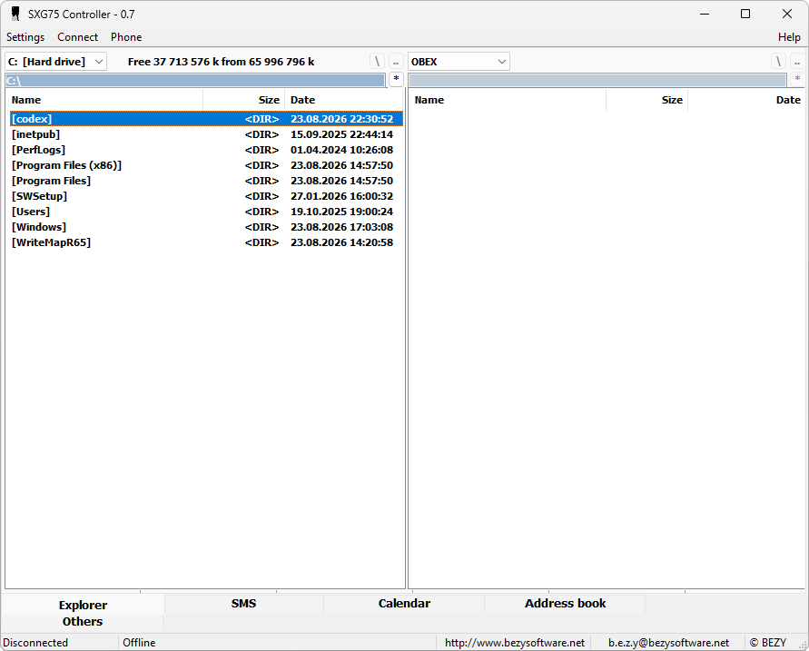

{/* Generated by tools/generateSoftware.ts. Do not edit manually. */}

# SXG75 Controller

**Автор:** SiemensMania.cz 
**Платформы:** BREW

SXG75 Controller работает с файловой системой Siemens SXG75 через OBEX и BREW: показывает каталоги телефона и компьютера, копирует,
переименовывает и удаляет файлы. Также программа читает и записывает SMS, устанавливает темы и переносит Java-приложения и игры в
соответствующие каталоги телефона.

## Версии

- **0.7** — [sxg75-controller-0.7.zip](https://git.siepatch.dev/siepatch/soft/media/branch/main/catalog/explorers/sxg75-controller/files/sxg75-controller-0.7.zip) Windows 32-bit · 519 КиБ
