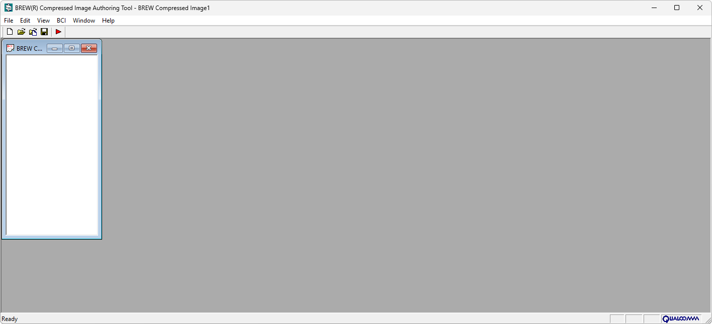

{/* Generated by tools/generateSoftware.ts. Do not edit manually. */}

# BREW Compressed Image Authoring Tool

**Автор:** QUALCOMM Incorporated 
**Платформы:** BREW

BREW Compressed Image Authoring Tool предназначен для создания ресурсов BCI,
используемых приложениями BREW. Программа импортирует изображения, преобразует
их во внутренний сжатый формат BREW и позволяет просматривать отдельные кадры
анимации.

## Версии

- **3.0.4.7** — [bci-authoring-tool-3.0.4.7.zip](https://git.siepatch.dev/siepatch/soft/media/branch/main/catalog/modding/bci-authoring-tool/files/bci-authoring-tool-3.0.4.7.zip) Windows 32-bit · 205 КиБ
