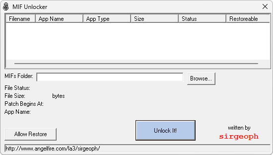

{/* Generated by tools/generateSoftware.ts. Do not edit manually. */}

# MIF Unlocker

**Автор:** SirGeoph 
**Платформы:** BREW

MIF Unlocker изменяет служебные поля MIF-файлов: устанавливает для BREW-приложения
статус Unlimited Use и разрешает его восстановление. Для приложений с рингтонами
программа устанавливает 255 кредитов.

В версии 1.2.5 добавлен выбор MIF-файла и исправлены ошибки.

## Версии

- **1.2.5** — [mif-unlocker-1.2.5.zip](https://git.siepatch.dev/siepatch/soft/media/branch/main/catalog/modding/mif-unlocker/files/mif-unlocker-1.2.5.zip) Windows 32-bit · 15.3 КиБ
