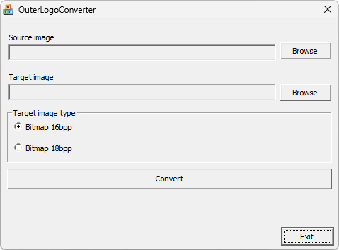

{/* Generated by tools/generateSoftware.ts. Do not edit manually. */}

# Outer Logo Converter

**Автор:** BenQ Poland 
**Платформы:** BREW

Outer Logo Converter преобразует изображение в 16- или 18-битный растровый
формат логотипа внешнего дисплея телефона. Пользователь выбирает исходный и
выходной файл и разрядность результата.

## Версии

- **1.0.0.1** — [outer-logo-converter-1.0.0.1.zip](https://git.siepatch.dev/siepatch/soft/media/branch/main/catalog/modding/outer-logo-converter/files/outer-logo-converter-1.0.0.1.zip) Windows 32-bit · 1.43 МиБ
