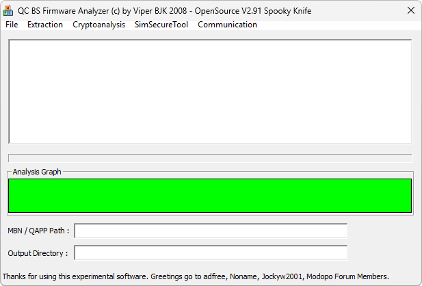

{/* Generated by tools/generateSoftware.ts. Do not edit manually. */}

# QC BS Firmware Analyzer

**Автор:** Viper BJK 
**Платформы:** BREW

QC BS Firmware Analyzer предназначен для исследования прошивок BenQ-Siemens на
платформе Qualcomm и работы с телефоном через диагностический порт.

Возможности:

- Разбор AMSS и таблицы разделов прошивки;
- Извлечение сертификатов и служебных блоков;
- Проверка подписей и контрольных сумм файлов прошивки;
- Вычисление и исправление CRC30 заголовка QCSBL;
- Шифрование и расшифровка служебных данных;
- Расчёт Mastercode, NetLockCode и других ключей;
- Работа с загрузчиком и Download Mode;
- Выполнение функций загрузчика и прошивка модема.

Программа распространялась как Open Source. В архивах сохранены готовые сборки,
исходный код проекта и использованная автором библиотека MIRACL.

## Версии

- **2.91** — [qc-bs-firmware-analyzer-2.91.zip](https://git.siepatch.dev/siepatch/soft/media/branch/main/catalog/modding/qc-bs-firmware-analyzer/files/qc-bs-firmware-analyzer-2.91.zip) (2008-04-04) Windows 32-bit · 2.12 МиБ

<strong>Архивные версии (4)</strong>

- **2.23** — [qc-bs-firmware-analyzer-2.23.zip](https://git.siepatch.dev/siepatch/soft/media/branch/main/catalog/modding/qc-bs-firmware-analyzer/files/qc-bs-firmware-analyzer-2.23.zip) (2008-04-03) Windows 32-bit · 2.10 МиБ
- **2.21** — [qc-bs-firmware-analyzer-2.21.zip](https://git.siepatch.dev/siepatch/soft/media/branch/main/catalog/modding/qc-bs-firmware-analyzer/files/qc-bs-firmware-analyzer-2.21.zip) (2008-02-25) Windows 32-bit · 2.09 МиБ
- **2.20** — [qc-bs-firmware-analyzer-2.20.zip](https://git.siepatch.dev/siepatch/soft/media/branch/main/catalog/modding/qc-bs-firmware-analyzer/files/qc-bs-firmware-analyzer-2.20.zip) (2008-02-18) Windows 32-bit · 2.09 МиБ
- **1.03 beta** — [qc-bs-firmware-analyzer-1.03-beta.zip](https://git.siepatch.dev/siepatch/soft/media/branch/main/catalog/modding/qc-bs-firmware-analyzer/files/qc-bs-firmware-analyzer-1.03-beta.zip) (2007-12-11) Отладочная сборка первого открытого бета-релиза Windows 32-bit · 775 КиБ

## Дополнительные файлы

- [qc-bs-firmware-analyzer-demo.zip](https://git.siepatch.dev/siepatch/soft/media/branch/main/catalog/modding/qc-bs-firmware-analyzer/files/qc-bs-firmware-analyzer-demo.zip) Видеодемонстрация работы программы 146 КиБ
