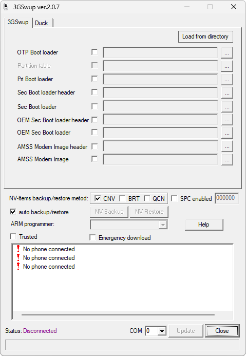

# 3GSwup2QPST

**Автор:** BenQ 
**Платформы:** BREW

3GSwup2QPST извлекает данные из сервисных обновлений 3GSwup и подготавливает комплект прошивки для загрузки через Qualcomm Product Support Tools.

## Версии

- **2.07** — [3gswup2qpst-2.07.zip](https://git.siepatch.dev/siepatch/soft/media/branch/main/catalog/service/3gswup2qpst/files/3gswup2qpst-2.07.zip) Windows 32-bit · 3.45 МиБ
- **2.07** — [3gswup2qpst-2.07-pro.zip](https://git.siepatch.dev/siepatch/soft/media/branch/main/catalog/service/3gswup2qpst/files/3gswup2qpst-2.07-pro.zip) Pro-версия Windows 32-bit · 3.45 МиБ
