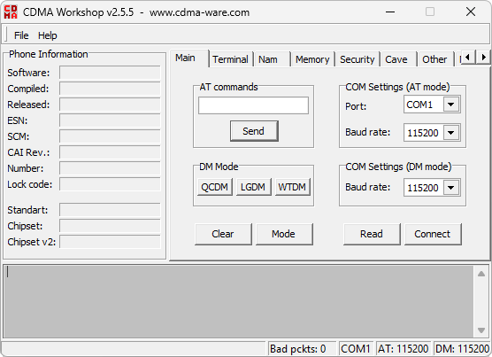

# CDMA Workshop

**Платформы:** BREW

CDMA Workshop работает с CDMA-телефонами через последовательный или диагностический порт. Программа читает память и NV-параметры,
работает с SPC и паролями, сохраняет резервные копии.

## Версии

- **2.70** — [cdma-workshop-2.70.zip](https://git.siepatch.dev/siepatch/soft/media/branch/main/catalog/service/cdma-workshop/files/cdma-workshop-2.70.zip) Windows 32-bit · 3.90 МиБ

<strong>Архивные версии (1)</strong>

- **2.55** — [cdma-workshop-2.55.zip](https://git.siepatch.dev/siepatch/soft/media/branch/main/catalog/service/cdma-workshop/files/cdma-workshop-2.55.zip) Windows 32-bit · 3.76 МиБ

