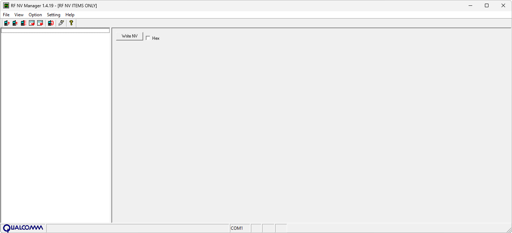

# QPST

**Автор:** QUALCOMM Incorporated 
**Платформы:** BREW

Qualcomm Product Support Tools — набор сервисных программ для телефонов на Qualcomm AMSS с BREW. В состав входят:

- QPST Configuration для настройки подключений;
- Software Download для загрузки прошивки и резервного копирования NV-параметров;
- EFS Explorer для работы с файловой системой телефона;
- Service Programming для настройки сервисных параметров;
- RF NV Item Manager для чтения и изменения радиочастотных NV-параметров.

## Версии

- **2.7 build 263** — [qpst-2.7.263.zip](https://git.siepatch.dev/siepatch/soft/media/branch/main/catalog/service/qpst/files/qpst-2.7.263.zip) Windows 32-bit · 8.79 МиБ

<strong>Архивные версии (3)</strong>

- **2.7 build 247** — [qpst-2.7.247.zip](https://git.siepatch.dev/siepatch/soft/media/branch/main/catalog/service/qpst/files/qpst-2.7.247.zip) (2006-04-07) Windows 32-bit · 10.6 МиБ
- **2.7 build 231** — [qpst-2.7.231.zip](https://git.siepatch.dev/siepatch/soft/media/branch/main/catalog/service/qpst/files/qpst-2.7.231.zip) Windows 32-bit · 8.31 МиБ
- **2.7 build 215** — [qpst-2.7.215.zip](https://git.siepatch.dev/siepatch/soft/media/branch/main/catalog/service/qpst/files/qpst-2.7.215.zip) Windows 32-bit · 8.13 МиБ

