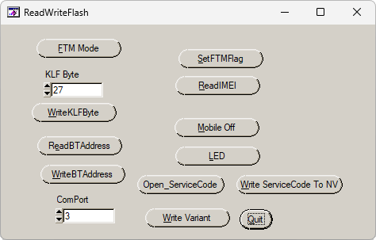

# ReadWriteFlash QC

**Автор:** siem 
**Платформы:** BREW

ReadWriteFlash QC работает с заводскими и NV-параметрами телефонов Qualcomm. Программа позволяет:

- Читать и записывать KLF byte;
- Записывать IMEI;
- Читать и записывать адрес Bluetooth;
- Читать и записывать название варианта;
- Открывать сервисный код и записывать его в NV;
- Переводить телефон в FTM и выключать его;
- Проверять светодиод и вспышку камеры.

После установки содержимое `Copy_Pack` необходимо скопировать в папку программы с заменой файлов.

## Версии

- **1.0** — [readwriteflash-qc-1.0.zip](https://git.siepatch.dev/siepatch/soft/media/branch/main/catalog/service/readwriteflash-qc/files/readwriteflash-qc-1.0.zip) Установщик и Copy_Pack с готовой программой, исходным кодом и необходимыми библиотеками Windows 32-bit · 6.35 МиБ
