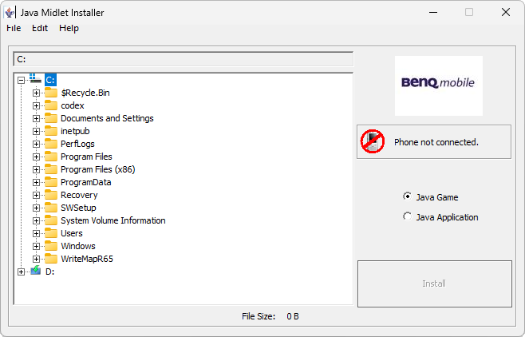

# Java Midlet Installer

**Автор:** BenQ Mobile 
**Платформы:** BREW

Java Midlet Installer устанавливает J2ME-мидлеты на телефон как приложение или игру. Пользователь выбирает локальный JAR либо JAD,
программа автоматически находит второй файл пары, копирует оба файла в соответствующий каталог телефона и предлагает перезагрузить
аппарат для завершения установки.

В комплект входит руководство пользователя и USB-драйверы.

## Версии

- **0.0.0.3** — [java-midlet-installer-0.0.0.3.zip](https://git.siepatch.dev/siepatch/soft/media/branch/main/catalog/utilities/java-midlet-installer/files/java-midlet-installer-0.0.0.3.zip) Windows 32-bit · 569 КиБ
