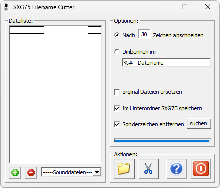

{/* Generated by tools/generateSoftware.ts. Do not edit manually. */}

# SXG75 Filename Cutter

**Автор:** -=[LCW]=-ExXtReMe 
**Платформы:** BREW

SXG75 Filename Cutter обрабатывает имена изображений, звуковых, текстовых и видеофайлов перед копированием на Siemens SXG75.
Программа ограничивает длину имени, удаляет выбранные специальные символы и может сохранить результат в отдельной папке `SXG75` или
заменить исходные файлы.

## Версии

- **0.3b** — [sxg75-filename-cutter-0.3b.zip](https://git.siepatch.dev/siepatch/soft/media/branch/main/catalog/utilities/sxg75-filename-cutter/files/sxg75-filename-cutter-0.3b.zip) Windows 32-bit · 76.2 КиБ
