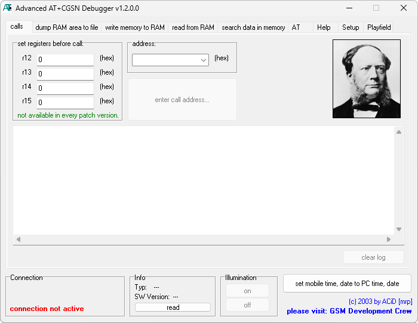

{/* Generated by tools/generateSoftware.ts. Do not edit manually. */}

# ATCGSN.Debug

**Домашняя страница:** [http://gsmdev.de/index.php?c=projekte](https://web.archive.org/web/20050313185721/http://gsmdev.de/index.php?c=projekte) (web archive) 
**Автор:** ACiD[mrp]

ATCGSN.Debug читает и изменяет RAM работающего телефона Siemens через расширенную команду AT+CGSN и установленный в прошивку патч.
Программа выполняет вызовы по адресу, записывает и запускает код, ищет данные в памяти и подключается через COM-порт, USB, IrDA или
Bluetooth. В комплект входят готовые патчи и инструкция по созданию патча для другого телефона.

Подробнее о разработке для EGOLD: [http://alexsid.antex.ru/index.php?main=techinfo.php](https://web.archive.org/web/20050901015815/http://alexsid.antex.ru/index.php?main=techinfo.php) (web archive)

## Версии

- **1.2.0.0** — [ATCGSN.Debug-1.2.0.0.zip](https://git.siepatch.dev/siepatch/soft/media/branch/main/catalog/development/debugging/atcgsn-debug/files/ATCGSN.Debug-1.2.0.0.zip) Windows 32-bit · 360 КиБ
