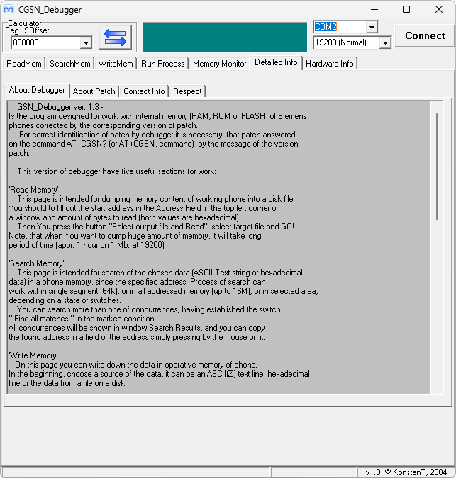

{/* Generated by tools/generateSoftware.ts. Do not edit manually. */}

# CGSN Debugger

**Домашняя страница:** [http://alexsid.antex.ru/index.php?main=techinfo.php](https://web.archive.org/web/20050901015815/http://alexsid.antex.ru/index.php?main=techinfo.php) (web archive) 
**Автор:** KonstanT

Дебаггер для работы с внутренней памятью RAM, ROM и Flash телефонов Siemens
на платформе EGOLD через соответствующую версию патча AT+CGSN.

- Чтение участка памяти в файл;
- Запись и заполнение памяти;
- Поиск данных в пределах сегмента;
- Мониторинг выбранного участка памяти;
- Вызов процедуры по заданному адресу с установкой значений регистров.

## Версии

- **1.3** — [CGSN-Debugger-1.3.zip](https://git.siepatch.dev/siepatch/soft/media/branch/main/catalog/development/debugging/cgsn-debugger/files/CGSN-Debugger-1.3.zip) Windows 32-bit · 379 КиБ
