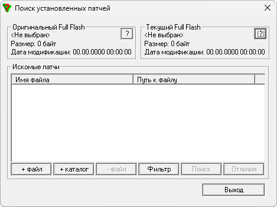

# FFPatch

**Домашняя страница:** [http://vi-soft.com.ua/](https://web.archive.org/web/20130813164842/http://vi-soft.com.ua/) (web archive) 
**Автор:** Александр Яблочкин

Сравнивает два файла FullFlash. Результат сравнения можно сохранить в VKP-файл.
Также программа ищет установленные патчи в образе FullFlash.

## Версии

- **0.4.2** — [ffpatch.zip](https://git.siepatch.dev/siepatch/soft/media/branch/main/catalog/development/utilities/vkp/ffpatch/files/ffpatch.zip) В комплекте руководство пользователя Windows 32-bit · 84.1 КиБ
