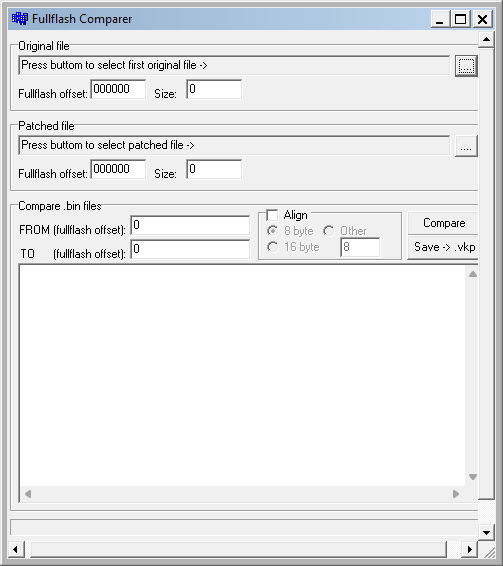

{/* Generated by tools/generateSoftware.ts. Do not edit manually. */}

# Fullflash Comparer

Fullflash Comparer сравнивает исходный и изменённый FullFlash в формате BIN.
Можно задать адресный диапазон и смещение FullFlash, после чего сохранить
найденные различия в виде патча VKP для V_KLay.

## Версии

- **1.0** — [fullflash-comparer-1.0.zip](https://git.siepatch.dev/siepatch/soft/media/branch/main/catalog/development/utilities/vkp/fullflash-comparer/files/fullflash-comparer-1.0.zip) Windows 32-bit · 635 КиБ
