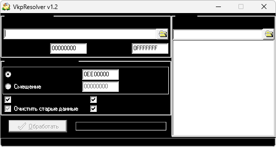

{/* Generated by tools/generateSoftware.ts. Do not edit manually. */}

# VkpResolver

**Автор:** Тараканов

VkpResolver — продолжение VkpTracer, написанное для разрешения конфликтов между
графическими VKP-патчами. Такие конфликты возникают, когда новый патч записывает
изображение в область флеша, уже занятую установленным ранее патчем.

Программа анализирует VKP-файлы из выбранной папки и переносит новый патч в
свободную область после максимального использованного адреса. Можно указать
новый начальный адрес или шестнадцатеричное смещение, ограничить обрабатываемый
диапазон адресов, исправить таблицы ссылок, очистить старые данные и собрать
непрерывный патч без промежутков. Результат записывается в файл с суффиксом
`_out`.

## Версии

- **1.0** — [vkp-resolver-1.0.zip](https://git.siepatch.dev/siepatch/soft/media/branch/main/catalog/development/utilities/vkp/vkp-resolver/files/vkp-resolver-1.0.zip) (2005-03-24) Windows 32-bit · 289 КиБ
