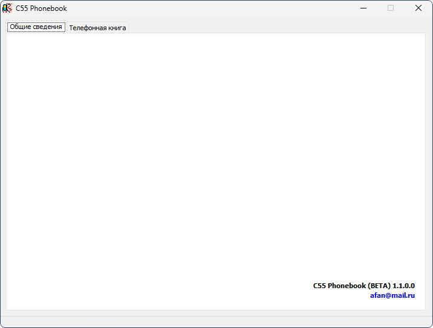

# C55 Phonebook

**Тема на форуме:** [http://forum.siemens-club.ru/viewtopic.php?TopicID=13060](http://forum.siemens-club.ru/viewtopic.php?TopicID=13060) 
**Платформы:** x10/x25 (HIGOLD), x35/x45/x55 (EGOLD), ODM

Программа для редактирования телефонных книг мобильных телефонов Siemens.

Автор проверял программу на C55, C45 и M50, но она должна работать и с другими
телефонами Siemens, поддерживающими Unicode. В комплекте находятся конфигурации
для C25, C35, C45, C55, M35, M50, ME45, MT50, S25, S35, S40, S45, S45i, S55,
SL42, SL45i и SLIK.

Поддерживается синхронизация часов телефона через SNTP-сервер. Расширенная
адресная книга моделей ME, S и SL не поддерживается.

## Версии

- **1.1.0.0** — [c55-phonebook-1.1.0.0.zip](https://git.siepatch.dev/siepatch/soft/media/branch/main/catalog/explorers/c55-phonebook/files/c55-phonebook-1.1.0.0.zip) (2003-01-26) Windows 32-bit · 403 КиБ
