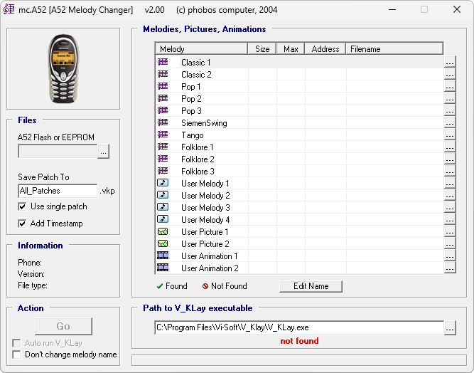

{/* Generated by tools/generateSoftware.ts. Do not edit manually. */}

# A52 Melody Changer

**Автор:** phobos computer 
**Платформы:** x35/x45/x55 (EGOLD)

Программа предназначена для изменения стандартных и пользовательских мелодий,
картинок и анимаций в Siemens A52. Она сама не записывает данные в телефон, а
создаёт патчи для V_KLay.

Можно открыть FullFlash или EEPROM, слитый V_KLay, найти адреса ресурсов,
заменить сразу несколько элементов и собрать для них общий либо отдельные патчи
с данными для отката. Поддерживаются изменение названий мелодий и автоматический
запуск V_KLay. Исходный дамп программа не изменяет.

## Версии

- **2.00** — [a52-melody-changer-2.00.zip](https://git.siepatch.dev/siepatch/soft/media/branch/main/catalog/modding/a52-melody-changer/files/a52-melody-changer-2.00.zip) Windows 32-bit · 208 КиБ
