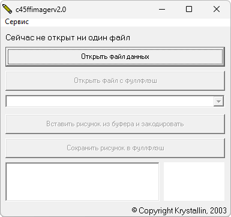

# Siemens C45ffimager

**Автор:** Krystallin 
**Платформы:** x35/x45/x55 (EGOLD)

Программа предназначена для смены графики в Siemens C45 и других телефонах, где
изображения кодируются по тому же принципу. Она кодирует рисунок по правилам
C45 и, если его можно сжать до размера исходного, вставляет в FullFlash на место
старого.

Поддерживается не только замена, но и добавление изображений по указанным
смещению и параметрам. Данные о картинках хранятся в отдельном файле списка; в
архив для примера включён список Siemens C45 с прошивкой 50.

## Версии

- **2.0.1** — [c45ffimager-2.0.1.zip](https://git.siepatch.dev/siepatch/soft/media/branch/main/catalog/modding/c45ffimager/files/c45ffimager-2.0.1.zip) Windows 32-bit · 215 КиБ
