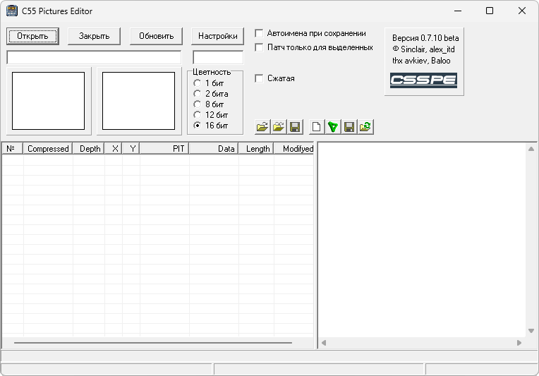

{/* Generated by tools/generateSoftware.ts. Do not edit manually. */}

# C55 Pictures Editor

**Автор:** Sinclair 
**Платформы:** x35/x45/x55 (EGOLD)

C55 Pictures Editor предназначен для замены встроенных изображений в прошивке
Siemens C55. Программа показывает найденную графику, позволяет подставить свои
картинки и сохранить изменения в виде патча.

## Версии

- **0.7.10.40** — [c55-pictures-editor-0.7.10.40.zip](https://git.siepatch.dev/siepatch/soft/media/branch/main/catalog/modding/c55-pictures-editor/files/c55-pictures-editor-0.7.10.40.zip) Windows 32-bit · 304 КиБ

<strong>Архивные версии (2)</strong>

- **0.7.8.36** — [c55-pictures-editor-0.7.8.36.zip](https://git.siepatch.dev/siepatch/soft/media/branch/main/catalog/modding/c55-pictures-editor/files/c55-pictures-editor-0.7.8.36.zip) (2004-11-03) Windows 32-bit · 304 КиБ
- **0.7.3.27** — [c55-pictures-editor-0.7.3.27.zip](https://git.siepatch.dev/siepatch/soft/media/branch/main/catalog/modding/c55-pictures-editor/files/c55-pictures-editor-0.7.3.27.zip) Windows 32-bit · 278 КиБ

