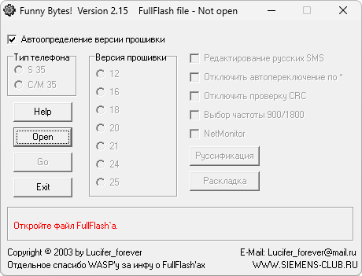

# FunnyBytes

**Автор:** Lucifer_forever 
**Платформы:** x35/x45/x55 (EGOLD)

FunnyBytes русифицирует FullFlash Siemens C35, M35 и S35. Программа автоматически определяет версию прошивки, редактирует русские SMS и раскладку клавиатуры, включает NetMonitor, переключает диапазон GSM 900/1800, отключает проверку CRC и автопереключение по `*`.

## Версии

- **2.15** — [funnybytes-2.15.zip](https://git.siepatch.dev/siepatch/soft/media/branch/main/catalog/modding/funnybytes/files/funnybytes-2.15.zip) (2003-07-10) Windows 32-bit · 262 КиБ
