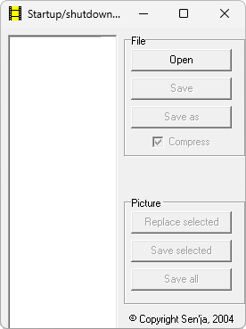

# PCAEdit

**Автор:** Sen'ja 
**Платформы:** x35/x45/x55 (EGOLD)

Программа предназначена для редактирования файла `graphcach.pca`, в котором
хранятся анимации включения и выключения телефона. Первые восемь изображений
относятся к включению, следующие восемь — к выключению. Их можно заменить своими
картинками и сохранить изменённый PCA-файл.

Размер вставляемых изображений должен совпадать с исходным.

## Версии

- **1.0** — [pcaedit-1.0.zip](https://git.siepatch.dev/siepatch/soft/media/branch/main/catalog/modding/pcaedit/files/pcaedit-1.0.zip) (2004-09-26) Windows 32-bit · 202 КиБ
