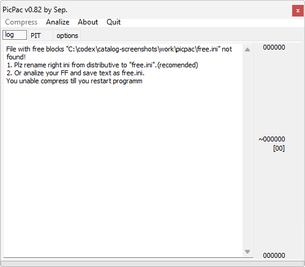

# PicPac

**Автор:** Sep. 
**Платформы:** x35/x45/x55 (EGOLD)

Идея программы состоит в следующем: в телефоне есть область памяти, где лежат картинки, и индекс этих картинок с их адресами — PIT.
Обычно при замене картинка записывается на старое место или в найденный свободный участок, а прежнее место пропадает. Если описать всё
место, занятое графикой, и при каждой смене переписывать картинки вместе с индексом, большую картинку можно разместить за счёт удаления
или уменьшения другой.

PicPac анализирует FullFlash и показывает место, занятое картинками, извлекает графику без изменения исходной палитры, укладывает
указанные картинки в заданные блоки и при успехе создаёт патч VKP. Поддерживаются несжатые и сжатые форматы 1, 2, 8, 12 и 16 бит,
несколько PIT, поиск дубликатов и свободных блоков, удаление ненужных изображений и запуск полученного патча в V_KLay.

В комплект входят настройки для C55, CF62, M55, MC60 и S55. С помощью собственного INI-файла программа может работать с другим
телефоном, для которого известны расположение PIT и области графики.

## Версии

- **0.82** — [picpac-0.82.zip](https://git.siepatch.dev/siepatch/soft/media/branch/main/catalog/modding/picpac/files/picpac-0.82.zip) Windows 32-bit · 258 КиБ
