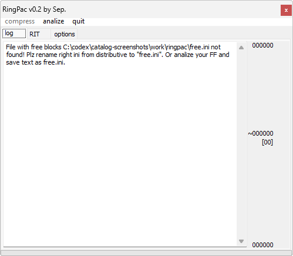

# RingPac

**Автор:** Sep. 
**Платформы:** x35/x45/x55 (EGOLD)

RingPac анализирует индекс встроенных мелодий RIT и занятые ими области
FullFlash. Программа показывает записи индекса, промежутки и свободные блоки,
извлекает отдельные или все мелодии в форматах MID, WAV и SRT.

Мелодии можно заново уложить в блоки, описанные в `free.ini`, и получить патч
VKP. Одинаковые файлы сохраняются один раз с несколькими ссылками из RIT. Это
позволяет ставить более крупные мелодии за счёт других и освобождать место под
Flex-диск или графику PicPac. Остаток блоков при необходимости заполняется
байтами `0xFF`; готовый патч можно сразу открыть в V_KLay.

## Версии

- **1.0.0.2** — [ringpac-1.0.0.2.zip](https://git.siepatch.dev/siepatch/soft/media/branch/main/catalog/modding/ringpac/files/ringpac-1.0.0.2.zip) Windows 32-bit · 233 КиБ
