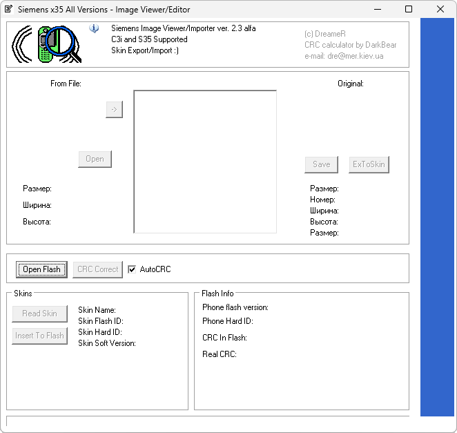

# Siemens Image Viewer/Importer

**Автор:** DreameR; CRC-калькулятор — DarkBear 
**Платформы:** x35/x45/x55 (EGOLD)

Программа открывает FullFlash Siemens x35, показывает встроенные изображения и позволяет заменять их. Поддерживаются импорт и экспорт скинов; для проверки данных встроен CRC-калькулятор.

## Версии

- **2.3 alpha** — [siemens-cms35-ie-2.3-alpha.zip](https://git.siepatch.dev/siepatch/soft/media/branch/main/catalog/modding/siemens-cms35-ie/files/siemens-cms35-ie-2.3-alpha.zip) Windows 32-bit · 249 КиБ
