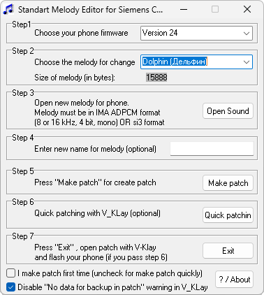

{/* Generated by tools/generateSoftware.ts. Do not edit manually. */}

# SMES

**Автор:** Mikhail Usov, Dmitry Lazarev; Borlland Group 
**Платформы:** x35/x45/x55 (EGOLD)

Программа предназначена для смены стандартных мелодий в Siemens C55. Поддерживаются прошивки 14 и 24; для других версий желательно
предварительно сделать резервную копию прошивки.

SMES заменяет звуки IMA ADPCM и мелодии SI3, при необходимости обрезает файл или дополняет его паузой, позволяет изменить название
мелодии, создаёт патч с данными для отката изменений и позволяет сразу запустить V_KLay.

## Версии

- **1.6** — [smes-1.6.zip](https://git.siepatch.dev/siepatch/soft/media/branch/main/catalog/modding/smes/files/smes-1.6.zip) Windows 32-bit · 230 КиБ

<strong>Архивные версии (1)</strong>

- **1.2.1** — [smes-1.2.1.zip](https://git.siepatch.dev/siepatch/soft/media/branch/main/catalog/modding/smes/files/smes-1.2.1.zip) Windows 32-bit · 170 КиБ

