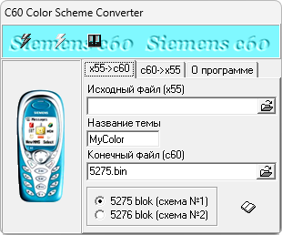

{/* Generated by tools/generateSoftware.ts. Do not edit manually. */}

# x55/C60 Color Converter

**Платформы:** x35/x45/x55 (EGOLD)

Программа преобразует файл цветовой схемы COL, созданный Color Scheme Editor для Siemens x55, в BIN-блок для записи в EEPROM Siemens
C60. Форматы x55 и C60 отличаются назначением части строк, поэтому оттенки на экране редактора и телефона могут не совпадать.

## Версии

- **0.1** — [x55-c60-color-converter-0.1.zip](https://git.siepatch.dev/siepatch/soft/media/branch/main/catalog/modding/x55-c60-color-converter/files/x55-c60-color-converter-0.1.zip) Windows 32-bit · 203 КиБ
