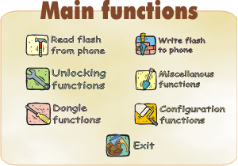

# Freia

**Автор:** Nutzo 
**Платформы:** x35/x45/x55 (EGOLD)

Программа командной строки и с графическим интерфейсом, главным образом для разблокировки и прошивки телефонов Siemens.

- Создание резервной MAP-копии EEPROM перед разблокировкой
- Прямая разблокировка телефона и создание MAP из log-файла
- Чтение и запись flash-памяти в форматах KSI, FLS и raw
- Работа с FullFlash в режиме эмуляции без подключённого телефона
- Расшифровка блоков EEPROM
- Резервное копирование и восстановление параметров аккумулятора
- Чтение информации о телефоне и запись flash IMEI
- Работа через COM-порт на скоростях до 921600 бит/с

В поздних версиях добавлена поддержка A52, A60, C60, M55, MC60, SX1, загрузка через bootcore bug и работа с интерфейсом Prodigy.

## Версии

- **18** — [freia-18.zip](https://git.siepatch.dev/siepatch/soft/media/branch/main/catalog/service/freia/files/freia-18.zip) Windows 32-bit · 655 КиБ

<strong>Архивные версии (4)</strong>

- **15** — [freia-15.zip](https://git.siepatch.dev/siepatch/soft/media/branch/main/catalog/service/freia/files/freia-15.zip) (2004-05-06) Windows 32-bit · 691 КиБ
- **10** — [freia-10.zip](https://git.siepatch.dev/siepatch/soft/media/branch/main/catalog/service/freia/files/freia-10.zip) (2004-03-04) Windows 32-bit · 687 КиБ
- **9** — [freia-9.zip](https://git.siepatch.dev/siepatch/soft/media/branch/main/catalog/service/freia/files/freia-9.zip) (2003-12-10) Windows 32-bit · 773 КиБ
- **8** — [freia-8.zip](https://git.siepatch.dev/siepatch/soft/media/branch/main/catalog/service/freia/files/freia-8.zip) (2003-09-25) Windows 32-bit · 767 КиБ

