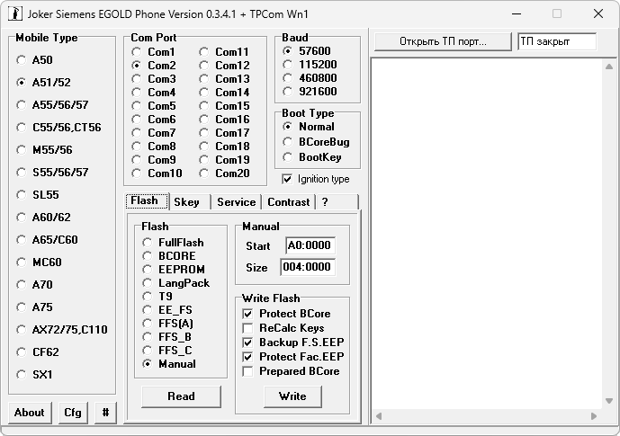

# Joker

**Домашняя страница:** [http://papuas.allsiemens.com/Joker.htm](https://web.archive.org/web/20071011012321/http://papuas.allsiemens.com/Joker.htm) (web archive) 
**Автор:** Papuas 
**Платформы:** x35/x45/x55 (EGOLD)

Это программа для работы с моделями на EGOLD-платформе: A50, A51, A52, A55,
A56, A57, A60, A62, A65, A70, A75, AX72, AX75, C55, C56, C60, CF62, CF110,
M55, MC60, S55, S56, SL55, SX1 и аналогичными.

Данная программа создаётся для восстановления всех софт-неисправностей
телефонов Siemens на EGOLD-платформе с помощью простого кабеля с минимальными
доработками в комплекте с Siemens EEPROM Tool.

Все методы и т. д. только в режиме теста. Если Вы испортите свой телефон —
это Ваша проблемка!

## Версии

- **0.3.7.2** — [JokerV0372.zip](https://git.siepatch.dev/siepatch/soft/media/branch/main/catalog/service/joker/files/JokerV0372.zip) (2010-03-14) Бета-версия для чтения FullFlash A58 Windows 32-bit · 1.14 МиБ
- **0.3.5.6** — [JokerV0356.zip](https://git.siepatch.dev/siepatch/soft/media/branch/main/catalog/service/joker/files/JokerV0356.zip) Неофициальная версия для A70 Windows 32-bit · 909 КиБ
- **0.3.4.3** — [JokerV0343.zip](https://git.siepatch.dev/siepatch/soft/media/branch/main/catalog/service/joker/files/JokerV0343.zip) Windows 32-bit · 210 КиБ

<strong>Архивные версии (7)</strong>

- **0.3.7.1** — [JokerV0371.zip](https://git.siepatch.dev/siepatch/soft/media/branch/main/catalog/service/joker/files/JokerV0371.zip) (2010-03-13) Бета-версия для чтения FullFlash A58 Windows 32-bit · 1.14 МиБ
- **0.3.5.4** — [JokerV0354.zip](https://git.siepatch.dev/siepatch/soft/media/branch/main/catalog/service/joker/files/JokerV0354.zip) Неофициальная версия для A70 Windows 32-bit · 1.79 МиБ
- **0.3.5.2** — [JokerV0352.zip](https://git.siepatch.dev/siepatch/soft/media/branch/main/catalog/service/joker/files/JokerV0352.zip) Windows 32-bit · 288 КиБ
- **0.3.4.1** — [JokerV0341.zip](https://git.siepatch.dev/siepatch/soft/media/branch/main/catalog/service/joker/files/JokerV0341.zip) Windows 32-bit · 358 КиБ
- **0.3.4.1** — [JokerV0341-UFSx.zip](https://git.siepatch.dev/siepatch/soft/media/branch/main/catalog/service/joker/files/JokerV0341-UFSx.zip) Версия для работы с программатором UFS; порт KarwosGSM.PL Team Windows 32-bit · 595 КиБ
- **0.2.9.5** — [JokerV0295.zip](https://git.siepatch.dev/siepatch/soft/media/branch/main/catalog/service/joker/files/JokerV0295.zip) (2005-11-25) Windows 32-bit · 201 КиБ
- **0.2.8.3** — [JokerV0283.zip](https://git.siepatch.dev/siepatch/soft/media/branch/main/catalog/service/joker/files/JokerV0283.zip) Windows 32-bit · 202 КиБ
- **0.0.5.3** — [JokerV0053.zip](https://git.siepatch.dev/siepatch/soft/media/branch/main/catalog/service/joker/files/JokerV0053.zip) Windows 32-bit · 141 КиБ

## Дополнительные файлы

- [JokerSorceV0341.zip](https://git.siepatch.dev/siepatch/soft/media/branch/main/catalog/service/joker/files/JokerSorceV0341.zip) Исходный код Joker 0.3.4.1 для Borland Delphi Windows 32-bit · 151 КиБ
