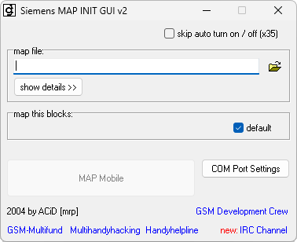

{/* Generated by tools/generateSoftware.ts. Do not edit manually. */}

# MapInit

**Автор:** Siemens AG; GUI и модификация — ACiD[mrp] 
**Платформы:** x35/x45/x55 (EGOLD)

Графическая оболочка для сервисной программы Siemens MapInit 1.14. Она загружает
MAP-файл, показывает его версию и блоки, позволяет выбрать нужные блоки и
записать их в EGOLD-телефон. Перед записью создаётся резервная копия EELITE.

Модификация ACiD[mrp] разрешает запись MAP с неверной контрольной суммой и MAP,
предназначенных для другой модели телефона.

## Версии

- **2.0** — [mapinit-2.0.zip](https://git.siepatch.dev/siepatch/soft/media/branch/main/catalog/service/mapinit/files/mapinit-2.0.zip) (2004-02-03) Windows 32-bit · 518 КиБ
