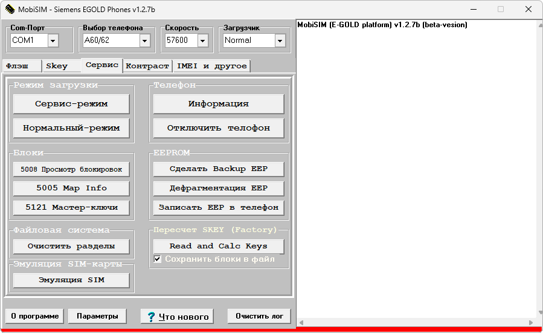

# MobiSIM

**Автор:** X-MaSS-X; сборка — Krolik 
**Платформы:** x35/x45/x55 (EGOLD)

MobiSIM работает с flash-памятью, SKey и мастер-ключами, EEPROM, IMEI и контрастом телефонов Siemens на платформе EGOLD. Переводит телефон в сервисный и нормальный режимы, показывает информацию о телефоне, очищает разделы файловой системы и эмулирует SIM-карту.

## Версии

- **1.2.7b** — [mobisim-1.2.7b.zip](https://git.siepatch.dev/siepatch/soft/media/branch/main/catalog/service/mobisim/files/mobisim-1.2.7b.zip) Специальная сборка Krolik для Siemens Windows 32-bit · 358 КиБ
