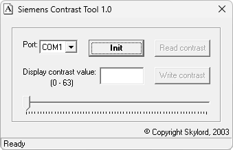

{/* Generated by tools/generateSoftware.ts. Do not edit manually. */}

# Siemens Contrast Tool

**Автор:** Skylord 
**Платформы:** x35/x45/x55 (EGOLD)

Программа предназначена для настройки контраста телефонов Siemens. Это бывает
нужно, например, после апгрейда S/ME45 в S45i, когда телефон работает, но на
экране ничего не видно.

После подключения кабеля и перехода в Service Mode контраст от 0 до 63 можно
менять ползунком или вводить числом и сразу видеть результат на дисплее. Кнопка
`Read contrast` читает исходное значение, а `Write contrast` сохраняет выбранное
значение в телефоне.

## Версии

- **1.0** — [siemens-contrast-tool-1.0.zip](https://git.siepatch.dev/siepatch/soft/media/branch/main/catalog/service/siemens-contrast-tool/files/siemens-contrast-tool-1.0.zip) (2003-04-06) Windows 32-bit · 22.3 КиБ
