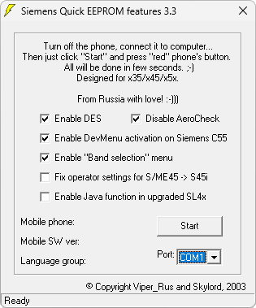

{/* Generated by tools/generateSoftware.ts. Do not edit manually. */}

# Siemens Quick EEPROM Features

**Автор:** Skylord 
**Платформы:** x35/x45/x55 (EGOLD)

Путём записи исправленных блоков EEPROM через ServiceMode программа позволяет включать следующие функции:

- Доступ к диску телефонов M50, MT50 и C55 с компьютера.
- Отключение проверки «самолёта» на C45, S45, ME45, S45i, M50, MT50, C55, S55, SL55 и M55.
- Исправление невозможности переназначить функциональные клавиши на C45.
- Активация Developer Menu на C55 через номер на SIM-карте.
- Добавление пункта выбора диапазона GSM на телефонах 35-й, 45-й, 50-й и 55-й серий.
- Исправление блока 68 после переделки S45 или ME45 в S45i.
- Запись блока 5005, включающего Java в SL45 или прошитом SL42.

Программа сама определяет доступные для подключённого телефона возможности и перед записью сохраняет резервную копию EEPROM-блока в
файл EEP. Поддерживается работа с выключенным телефоном через ServiceMode и с включёнными аппаратами x55.

## Версии

- **3.3** — [siemens-quick-eeprom-features-3.3.zip](https://git.siepatch.dev/siepatch/soft/media/branch/main/catalog/service/siemens-quick-eeprom-features/files/siemens-quick-eeprom-features-3.3.zip) Windows 32-bit · 690 КиБ
