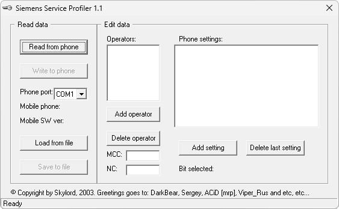

{/* Generated by tools/generateSoftware.ts. Do not edit manually. */}

# Siemens Service Profiler

**Автор:** Skylord 
**Платформы:** x35/x45/x55 (EGOLD)

Программа предназначена для редактирования блока 71 EEPROM, который называется Factory Service Profile. В нём хранятся небольшие
настройки в стиле флажков «да/нет», причём их значения могут меняться в зависимости от установленной SIM-карты, а точнее — её оператора.

Можно загрузить блок из телефона или файла, изменить список операторов и назначенные каждому из них функции, а затем сохранить блок
обратно. Описания флажков находятся в простом INI-файле, который можно дополнять для разных моделей телефонов.

## Версии

- **1.1** — [siemens-service-profiler-1.1.zip](https://git.siepatch.dev/siepatch/soft/media/branch/main/catalog/service/siemens-service-profiler/files/siemens-service-profiler-1.1.zip) Windows 32-bit · 42.8 КиБ

<strong>Архивные версии (1)</strong>

- **1.0** — [siemens-service-profiler-1.0.zip](https://git.siepatch.dev/siepatch/soft/media/branch/main/catalog/service/siemens-service-profiler/files/siemens-service-profiler-1.0.zip) Windows 32-bit · 41.4 КиБ

