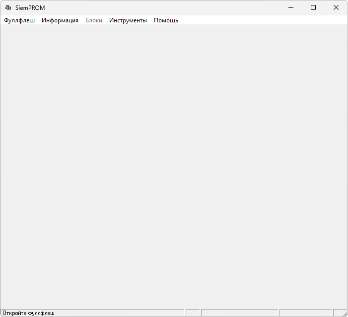

{/* Generated by tools/generateSoftware.ts. Do not edit manually. */}

# SiemPROM

**Домашняя страница:** [http://avkiev.siemens-club.ru/Siemens/SiemPROM/SiemPROM.htm](http://avkiev.siemens-club.ru/Siemens/SiemPROM/SiemPROM.htm) 
**Автор:** avkiev 
**Платформы:** x35/x45/x55 (EGOLD)

SiemPROM смотрит на FullFlash, извлекает информацию о блоках EEPROM, их смещении и размере и показывает её пользователю. Для известных
блоков доступна дополнительная расшифровка содержимого.

Программа поддерживает пользовательский словарь T9, приветствие, группы, WAP-закладки, заметки, будильник, инженерное меню x55, список
SMS, Factory Service Profile, пользовательские фразы, Bluetooth-идентификацию и известные устройства, таймаут Java-соединения и другие
служебные блоки.

SiemPROM тестировался автором на телефонах Siemens 35-й, 45-й, 50-й и 55-й серий. Описания блоков находятся во внешнем файле
`eeprom.dsc`, который можно дополнять.

## Версии

- **1.78** — [siemprom-1.78.zip](https://git.siepatch.dev/siepatch/soft/media/branch/main/catalog/service/siemprom/files/siemprom-1.78.zip) Windows 32-bit · 51.4 КиБ
