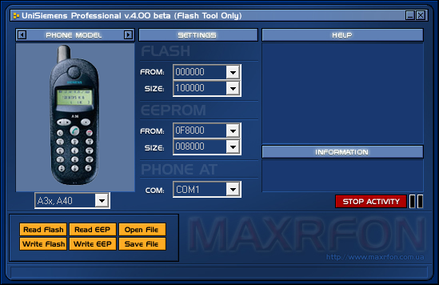

# UniSiemens Professional

**Платформы:** x35/x45/x55 (EGOLD), ODM

Программа для чтения и записи FullFlash, EEPROM или отдельного диапазона flash-памяти телефонов Siemens.

Поддерживаются C30, S40, модели семейств x35 и x45, а при выборе SL4x — A50, M50 и MT50. В комплект входят загрузчики для разных семейств телефонов.

## Версии

- **4.00 beta** — [unisiemens-4.00-beta.zip](https://git.siepatch.dev/siepatch/soft/media/branch/main/catalog/service/unisiemens/files/unisiemens-4.00-beta.zip) В комплекте usimload.exe для запуска без аппаратного ключа Windows 32-bit · 589 КиБ
