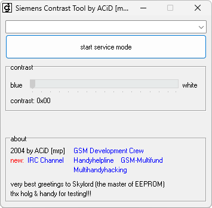

{/* Generated by tools/generateSoftware.ts. Do not edit manually. */}

# X55 Contrast Tool

**Платформы:** x35/x45/x55 (EGOLD)

X55 Contrast Tool подключается к телефону Siemens x55 через COM-порт и позволяет
прочитать, изменить и сохранить значение контраста дисплея.

## Версии

- **1.4** — [x55-contrast-tool-1.4.zip](https://git.siepatch.dev/siepatch/soft/media/branch/main/catalog/service/x55-contrast-tool/files/x55-contrast-tool-1.4.zip) (2004-02-06) Windows 32-bit · 236 КиБ
