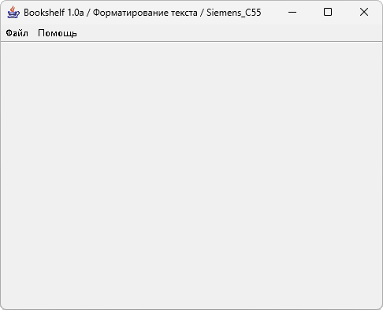

# Bookshelf

**Автор:** Антон Красовский 
**Платформы:** x35/x45/x55 (EGOLD)

Bookshelf позволяет преобразовать один или несколько текстовых файлов в готовый для установки мидлет. При запуске мидлета на телефоне
пользователь получает возможность читать включённые в него тексты.

Для каждого текста можно выбрать кодировку CP1251 или KOI8-R, язык переносов, отступы, межстрочное расстояние и шрифт. Программа
показывает, как текст будет выглядеть на экране телефона, и поддерживает шрифты Palm Pilot в форматах PDB и PFT.

В создаваемую книгу можно включить плагины для перехода к странице и между текстами, просмотра информации, автоматической постраничной
или плавной прокрутки. Поддерживаются Siemens SL45i, C55, M50, S55 и SL55.

## Версии

- **1.0a** — [bookshelf-1.0a.zip](https://git.siepatch.dev/siepatch/soft/media/branch/main/catalog/utilities/bookshelf/files/bookshelf-1.0a.zip) Java · 684 КиБ
